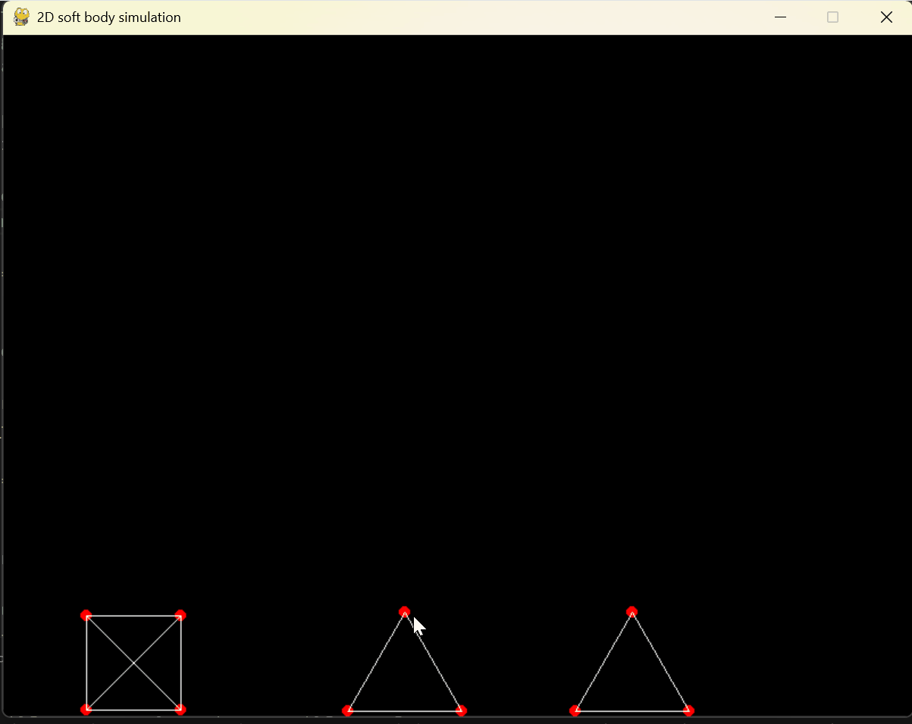

<!-- PROJECT LOGO -->
<br />
<div align="center">
  <a href="https://github.com/Robijn98/softBodyPhysics/blob/main">
    
  </a>
  <h3 align="center">Topology Transfer Tool</h3>
  
</div>

<!-- ABOUT THE PROJECT -->
## About The Project

This is a stand-alone program that's physics-based creating figures that can move according to springs 
and use connection points to determine collisions, simulating 2D soft-body physics. 

### Built With
<div align="center">
  
[](#)
[](#)


</div>

<!-- GETTING STARTED -->
## Getting Started
### Prerequisites

To run you will need the following 
- python 3.13.0
- pygame 2.6.1

### Installation
Clone the repo
   ```sh
   git clone https://github.com/Robijn98/softBodyPhysics.git
   ```
<!-- USAGE EXAMPLES -->
## Usage

To use the program you can simply clone the repo and run the main file. 
Note that collisions and spring work best when objects can interact naturally so try not 
to hold on to the objects indefintely for best results. 

> [!WARNING]  
> Collisions can break with certain speeds

<!-- ROADMAP -->
## Roadmap 
- [x] Create springs
- [x] Collision detection
- [x] Interactive shapes 
- [ ] Shapematching
- [ ] Have a UI for inputs
- [ ] Ability to create shapes yourself

<!-- ACKNOWLEDGMENTS -->
## Acknowledgments
N. Lisitsa, 2023, Making a 2D soft-body physics engine, available from: https://lisyarus.github.io/blog/posts/soft-body-physics.html

T. FitzRandolph, 2022, Deep Dive: The soft body physics of JellyCar, explained, available from: https://www.gamedeveloper.com/programming/deep-dive-the-soft-body-physics-of-jelly-car-explained

GeeksForGeeks, 2024, Minimum distance from a point to the line segment using Vectors, available from: https://www.geeksforgeeks.org/minimum-distance-from-a-point-to-the-line-segment-using-vectors/


